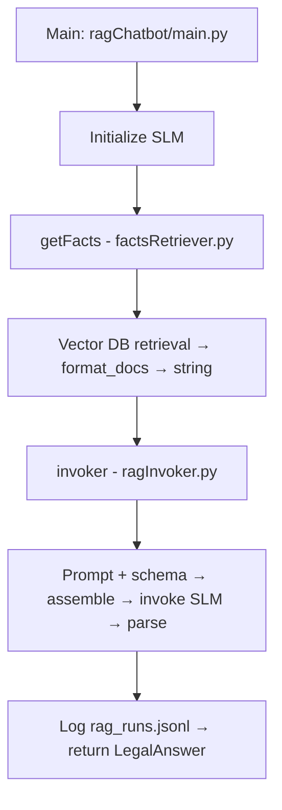

# legalos_rag

**Local helper module** containing the structured parts of the RAG pipeline: retrieval, prompt templates, output schemas, and invocation. Used by `ragChatbot/main.py`; not run standalone.

---

### Directory structure

```text
legalos_rag/
├── README.md
├── __init__.py
├── promptSchema.py    
├── prompts.py        
├── factsRetriever.py 
└── ragInvoker.py     
```

---

## Module structure & execution flow

### `promptSchema.py`

Pydantic schemas for structured outputs: `LegalAnswer` (answer_found, act_name, section, explanation, citations) and `Citation` (pdf_number, page, file_name, quote).

### `prompts.py`

RAG prompt template: legal-reader instructions, facts placeholder, query placeholder, and format instructions from the output parser.

### `factsRetriever.py`

- **setup_vectorstore** — Build Qdrant vectorstore with HuggingFace embeddings.
- **format_docs** — Turn a list of documents into a single string for the prompt.
- **getFacts** — Retrieve top-k chunks for a query from the vector DB and return them formatted for the prompt.

### `ragInvoker.py`

- **invoker** — Load prompt + schema, assemble prompt with facts and query, invoke the SLM, parse response to `LegalAnswer`, log the run, return result.
- **log_rag_run** — Append one RAG run (query, prompt, output, model) as a JSONL line to `rag_runs.jsonl`.

---

## How the main file uses this module

`ragChatbot/main.py` is orchestration-only:

1. Initialize the SLM (e.g. Ollama).
2. Call **getFacts(db_path, query)** from `factsRetriever` to get retrieved context (formatted string).
3. Call **invoker(slm, retrieved_docs, query, model_name)** from `ragInvoker` to get a structured `LegalAnswer`.

Example:

```python
retrieved_docs = legalos_rag.factsRetriever.getFacts(q=query, db_path=db_path)
result = legalos_rag.ragInvoker.invoker(slm, retrieved_docs, query, SLM_MODEL_NAME)
```

This keeps retrieval and model invocation separate so you can swap or compare models after a single retrieval step.

---

## Logging (`rag_runs.jsonl`)

Each RAG run is appended as one JSON line: timestamp, model, query, final_prompt, and parsed output. Used for prompt-engineering iteration and review without re-running experiments.

---

## Execution flow


