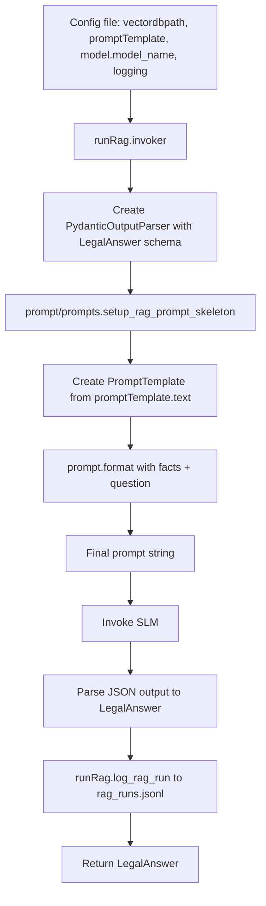

# legalos_rag

**Local helper package** for the RAG pipeline: config validation, query rewriting, multi-query retrieval, prompt building, SLM invocation, and logging. Used by `chatbot/main.py` and `test.promptTester.promptRunBatch`; not run standalone.

---

### Directory structure

```text
legalos_rag/
├── README.md
├── __init__.py
├── runRag.py
├── queryRewriter.py
└── prompt/
    ├── promptSchema.py
    └── prompts.py
```

---

## Module structure & execution flow

### `__init__.py`

- **_setup_slm(model_name)** — Build Ollama ChatOllama instance with the specified model name (temperature `0.3`).
- **ensure_requirements(config)** — Validate config and return `(db_path, promptTemplate, slm, model_name, logging)`. Required config keys:
  - `vectordbpath` — path to the Qdrant vector DB.
  - `promptTemplate` — object with a `"text"` key holding the full prompt template string.
  - `model.model_name` — Ollama model name (e.g. `"qwen2.5:3b-instruct"`).
  - `logging` (optional for batch runner) — object with `logfile`, `exclude_model_name`, `exclude_prompt`.


Used by both the interactive CLI (`chatbot.main`) and the batch runner (`test.promptTester.promptRunBatch`).

### `prompt/promptSchema.py`

Pydantic schemas for structured outputs: `LegalAnswer` (answer_found, act_name, section, explanation, citations) and `Citation` (pdf_number, page, file_name, quote).

### `prompt/prompts.py`

- Builds the **RAG prompt skeleton**:
  - Takes a full prompt template string (from config’s `promptTemplate.text`).
  - Injects `format_instructions` from the output parser.
  - Returns a LangChain `PromptTemplate` with `input_variables=["facts", "question"]` and `partial_variables={"format_instructions": ...}`.

### `queryRewriter.py`

- **rewrite_and_expand(query, slm)** — Uses the same Ollama model as the main SLM (temperature `0.3`) with a small legal-terminology prompt and `PydanticOutputParser` to produce two short search strings: **`rewritten`** (main issue in statutory-style language) and **`variant`** (related angle such as remedy or procedure). The model is instructed not to name specific Acts. Returns `[original, rewritten, variant]` on success, or `[original]` if parsing or the SLM fails (retrieval still runs on the user query only).

### `runRag.py`

Central RAG logic:

- **getFacts(q, db_path)** — Setup Qdrant vectorstore (HuggingFace embeddings), retrieve top-k chunks for a single query string, return them formatted as a single string for the prompt. Still available for single-query retrieval.
- **getFactsMulti(queries, db_path)** — For each query string, runs `similarity_search_with_score` with `k=3`, deduplicates hits by `(pdf_number, page)` keeping the best score per chunk, sorts by score, and returns up to **5** chunks formatted like `getFacts`. Used by `chatbot.main.run_rag` after `rewrite_and_expand`.
- **invoker(slm, retrievedChunks, query, template)** — Build output parser for `LegalAnswer`, build prompt from `prompt/prompts.setup_rag_prompt_skeleton`, format with facts and **the original user question** (not the rewrite), invoke the SLM, parse response into `LegalAnswer`. Returns `(parsed_result: LegalAnswer, final_prompt_text: str)`. Does **not** log.
- **log_rag_run(query, final_prompt, output, model, log_file, exclude_model_name, exclude_prompt)** — Append one RAG run as a JSONL line to the given log file. Called from `run_rag_loop()` in `chatbot/main.py` after each single RAG run (not from `run_rag`, which does not log).

---


## Retrieval workflow (before the prompt)

1. **rewrite_and_expand** — Turn the user question into one or three search strings (original plus optional legal phrasings).
2. **getFactsMulti** — Retrieve and merge evidence from all strings with deduplication by document page.
3. **invoker** — Answer using the original question text and the merged facts (see below).

## Prompt workflow

End-to-end prompt formation looks like this:

1. **Config file**
   - Contains:
     - `vectordbpath`: path to the Qdrant DB (e.g. `"./vectorDB"`).
     - `promptTemplate`: object with a `"text"` key holding the full prompt template string.
     - `model.model_name`: Ollama model name for the SLM (e.g. `"qwen2.5:3b-instruct"`).
     - `logging`: object with `logfile`, `exclude_model_name`, `exclude_prompt`.

   Example:

   ```json
   {
     "vectordbpath": "./vectorDB",
     "promptTemplate": {
       "text": "You are a legal document reader...\\n\\nOutput:\\n{format_instructions}\\n\\nFacts:\\n{facts}\\n\\nQuery:\\n{question}"
     },
     "model": { "model_name": "qwen2.5:3b-instruct" },
     "logging": {
       "logfile": "chatbot/rag_runs.jsonl",
       "exclude_model_name": false,
       "exclude_prompt": true
     }
   }
   ```

2. **`prompt/prompts.setup_rag_prompt_skeleton(...)`**
   - Takes the `promptTemplate["text"]` string from the config.
   - Wraps it in a `PromptTemplate` with:
     - `{format_instructions}` filled from the output parser.
     - `{facts}` and `{question}` as runtime inputs.

3. **`runRag.invoker(...)`**
   - Calls `prompt.format(facts=retrievedChunks, question=query)` to produce the final string sent to the SLM, invokes the SLM, and parses the response into `LegalAnswer`.

4. **Logging via `runRag.log_rag_run(...)`**
   - The interactive session `run_rag_loop()` in `chatbot/main.py` calls `runRag.log_rag_run` with the query, final prompt text, parsed output, and model to append a JSON line to `rag_runs.jsonl` after each `run_rag()` call.

### Prompt workflow diagram



---

## Logging

The log file path is set in the config as `logging.logfile` (e.g. `chatbot/rag_runs.jsonl`). Each RAG run is appended as one JSONL line: timestamp, model, query, final_prompt, and parsed output, via `chatbot.legalos_rag.runRag.log_rag_run` from `run_rag_loop()` in `chatbot/main.py`. Config keys `logging.exclude_model_name` and `logging.exclude_prompt` control whether the model name and/or final prompt text are omitted from each log entry. Used for prompt-engineering iteration and review without re-running experiments.
