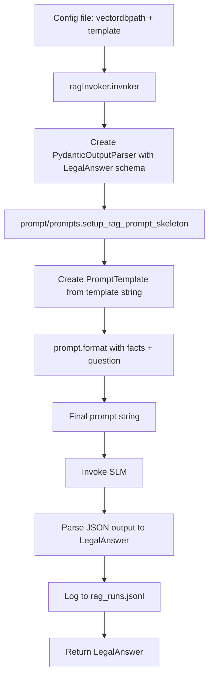

# legalos_rag

**Local helper module** containing the structured parts of the RAG pipeline: retrieval, prompt templates, output schemas, and invocation. Used by `chatbot/main.py`; not run standalone.

---

### Directory structure

```text
legalos_rag/
├── README.md
├── __init__.py
├── factsRetriever.py 
├── logger.py 
├── ragInvoker.py     
└── prompt/
    ├── promptSchema.py    
    └── prompts.py        
```

---

## Module structure & execution flow

### `prompt/promptSchema.py`

Pydantic schemas for structured outputs: `LegalAnswer` (answer_found, act_name, section, explanation, citations) and `Citation` (pdf_number, page, file_name, quote).

### `prompt/prompts.py`

- Builds the **RAG prompt skeleton**:
  - Takes a full prompt template string (loaded from a JSON config file).
  - Injects `format_instructions` from the output parser.
  - Returns a LangChain `PromptTemplate` with:
    - `input_variables=["facts", "question"]`
    - `partial_variables={"format_instructions": parser.get_format_instructions()}`.

### `factsRetriever.py`

- **setup_vectorstore** — Build Qdrant vectorstore with HuggingFace embeddings.
- **format_docs** — Turn a list of documents into a single string for the prompt.
- **getFacts** — Retrieve top-k chunks for a query from the vector DB and return them formatted for the prompt.

### `ragInvoker.py`

- **invoker** — Glue function that:
  - Builds the output parser for `LegalAnswer` (from `prompt/promptSchema.py`).
  - Calls `prompt/prompts.setup_rag_prompt_skeleton(parser, template)` to get the `PromptTemplate`.
  - Renders the final prompt text by formatting with:
    - `facts` (retrieved docs)
    - `question` (user query)
  - Invokes the SLM and parses the JSON-like output into `LegalAnswer`.
  - Returns a tuple `(parsed_result: LegalAnswer, final_prompt_text: str)`. It does **not** perform any logging.

### `logger.py`

- **safe_json** — Helper that serializes Python objects to JSON strings with `ensure_ascii=False`.
- **log_rag_run** — Append one RAG run (timestamp, query, final prompt text, parsed output, model) as a JSONL line to `rag_runs.jsonl`. Called from `chatbot/main.py` after `invoker` returns.

---

## How `chatbot/main.py` uses this module

`chatbot/main.py` is orchestration-only:

1. Read a JSON config file (path passed as the only CLI argument).
2. From that config, load:
   - `vectordbpath` — path to the Qdrant vector DB.
   - `template` — full RAG prompt template string.
3. Initialize the SLM (Ollama, `qwen2.5:3b-instruct`).
4. Call **`factsRetriever.getFacts(db_path, query)`** to fetch relevant chunks from the vector DB.
5. Call **`ragInvoker.invoker(slm, retrieved_docs, query, template)`** to build the prompt, invoke the SLM, and get a structured `LegalAnswer` plus the final prompt text.
6. Call **`logger.log_rag_run(...)`** to log the query, final prompt, parsed output, and model to `rag_runs.jsonl`.

Example:

```python
retrieved_docs = chatbot.legalos_rag.factsRetriever.getFacts(q=query, db_path=db_path)
result, final_prompt = chatbot.legalos_rag.ragInvoker.invoker(
    slm,
    retrieved_docs,
    query,
    template,   # template string loaded from the config file
)

chatbot.legalos_rag.logger.log_rag_run(
    query=query,
    final_prompt=final_prompt,
    output=result,
    model=SLM_MODEL_NAME,
    log_file=LOG_FILE,
)
```

This keeps retrieval and model invocation separate so you can swap:
- config files (each with its own `template`)
- models (via `SLM_MODEL_NAME`)
without changing the retrieval logic.

---

## Prompt workflow

End-to-end prompt formation looks like this:

1. **Config file**
   - Contains:
     - `vectordbpath`: path to the Qdrant DB (e.g. `"./vectorDB"`).
     - `template`: full prompt template string, e.g.:

   ```json
   {
     "vectordbpath": "./vectorDB",
     "template": "You are a legal document reader...\\n\\nOutput:\\n{format_instructions}\\n\\nFacts:\\n{facts}\\n\\nQuery:\\n{question}"
   }
   ```

2. **`prompt/prompts.setup_rag_prompt_skeleton(...)`**
   - Takes the `template` string from the config.
   - Wraps it in a `PromptTemplate` with:
     - `{format_instructions}` filled from the output parser.
     - `{facts}` and `{question}` as runtime inputs.

3. **`ragInvoker.invoker(...)`**
   - Calls `prompt.format(facts=retrieved_docs, question=query)` to produce the final string sent to the SLM, invokes the SLM, and parses the response into `LegalAnswer`.

4. **Logging via `logger.log_rag_run(...)`**
   - `chatbot/main.py` calls `logger.log_rag_run` with the query, final prompt text, parsed output, and model to append a JSON line to `rag_runs.jsonl`.

### Prompt workflow diagram



---

## Logging (`rag_runs.jsonl`)

Each RAG run is appended as one JSON line: timestamp, model, query, final_prompt, and parsed output, via `chatbot.legalos_rag.logger.log_rag_run` in `chatbot/main.py`. Used for prompt-engineering iteration and review without re-running experiments.
